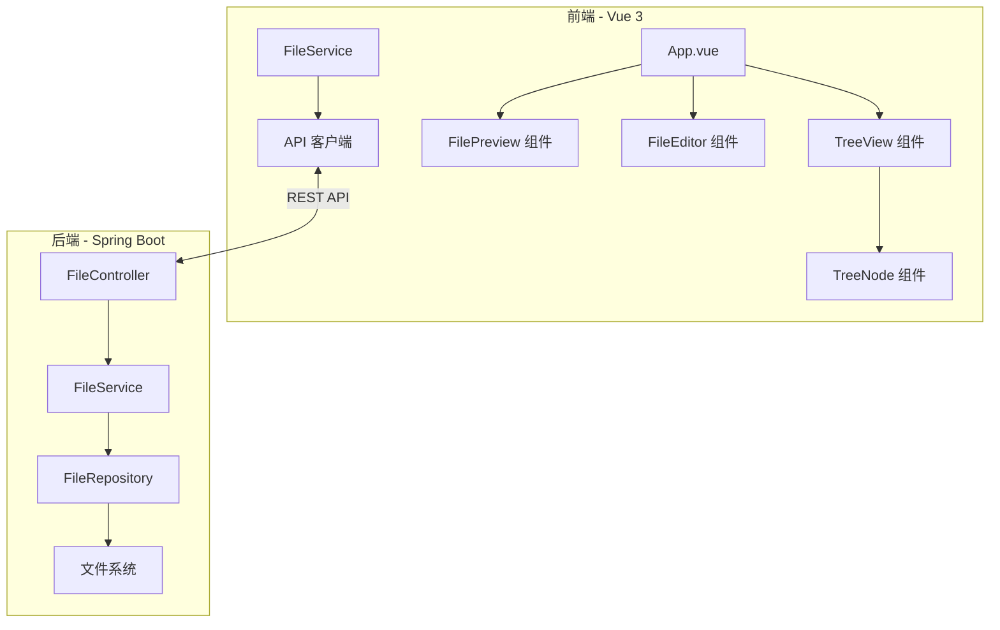

# 设计文档

## 概述

文件管理系统采用前后端分离架构，前端使用 Vue 3 + TypeScript 构建用户界面，后端使用 Spring Boot 提供 RESTful API 服务。系统支持文件和目录的浏览、预览、创建和编辑功能。

## 架构



### 系统分层

1. **表现层 (Vue 3)**
   - 树形视图组件：展示文件目录结构
   - 文件预览组件：根据文件类型渲染内容
   - 文件编辑器组件：编辑文本类文件

2. **API 层 (Spring Boot Controller)**
   - 处理 HTTP 请求
   - 参数验证和响应封装

3. **业务层 (Spring Boot Service)**
   - 文件操作逻辑
   - 文件类型识别
   - 安全验证

4. **数据访问层**
   - 文件系统操作封装

## 组件和接口

### 后端 API 接口

#### 1. 获取目录树
```
GET /api/files/tree?path={path}
```
响应:
```json
{
  "name": "root",
  "path": "/",
  "type": "directory",
  "children": [
    {
      "name": "docs",
      "path": "/docs",
      "type": "directory",
      "children": []
    },
    {
      "name": "readme.md",
      "path": "/readme.md",
      "type": "file",
      "extension": "md",
      "size": 1024
    }
  ]
}
```

#### 2. 获取文件内容
```
GET /api/files/content?path={path}
```
响应:
```json
{
  "path": "/readme.md",
  "content": "# Hello World",
  "encoding": "UTF-8",
  "mimeType": "text/markdown"
}
```

#### 3. 创建目录
```
POST /api/files/directory
```
请求体:
```json
{
  "path": "/new-folder",
  "name": "new-folder"
}
```

#### 4. 创建文件
```
POST /api/files/file
```
请求体:
```json
{
  "path": "/docs/new-file.md",
  "content": ""
}
```

#### 5. 保存文件
```
PUT /api/files/content
```
请求体:
```json
{
  "path": "/readme.md",
  "content": "# Updated Content"
}
```

#### 6. 检查文件是否存在
```
GET /api/files/exists?path={path}
```

### 前端组件

#### TreeView 组件
- Props: `rootPath`, `onSelect`
- Events: `node-click`, `node-expand`
- 功能: 递归渲染目录树，支持展开/折叠

#### FilePreview 组件
- Props: `filePath`, `fileType`
- 功能: 根据文件类型选择对应的预览器

#### FileEditor 组件
- Props: `filePath`, `content`
- Events: `save`, `change`
- 功能: 文本编辑和保存

## 数据模型

### FileNode (文件节点)
```typescript
interface FileNode {
  name: string;           // 文件/目录名
  path: string;           // 完整路径
  type: 'file' | 'directory';
  extension?: string;     // 文件扩展名
  size?: number;          // 文件大小(字节)
  children?: FileNode[];  // 子节点(仅目录)
  lastModified?: string;  // 最后修改时间
}
```

### FileContent (文件内容)
```typescript
interface FileContent {
  path: string;
  content: string;
  encoding: string;
  mimeType: string;
}
```

### ApiResponse (API 响应)
```typescript
interface ApiResponse<T> {
  success: boolean;
  data?: T;
  error?: string;
  message?: string;
}
```

### Java 实体类

```java
// FileNodeDTO.java
public class FileNodeDTO {
    private String name;
    private String path;
    private String type;
    private String extension;
    private Long size;
    private List<FileNodeDTO> children;
    private LocalDateTime lastModified;
}

// FileContentDTO.java
public class FileContentDTO {
    private String path;
    private String content;
    private String encoding;
    private String mimeType;
}
```


## 正确性属性

*属性是指在系统所有有效执行中都应保持为真的特征或行为——本质上是关于系统应该做什么的形式化陈述。属性是人类可读规范与机器可验证正确性保证之间的桥梁。*

基于验收标准分析，以下是可通过属性测试验证的正确性属性：

### 属性 1: 目录扫描完整性
*对于任意*目录结构，扫描返回的文件和目录总数应等于实际存在的文件和目录数量
**验证: 需求 1.1, 1.2, 1.4**

### 属性 2: 文件类型识别一致性
*对于任意*文件扩展名，系统应返回一致且正确的文件类型分类
**验证: 需求 1.3**

### 属性 3: 排序规则一致性
*对于任意*文件节点列表，排序后目录应始终在文件之前，且各组内按字母顺序排列
**验证: 需求 2.4**

### 属性 4: 图标映射一致性
*对于任意*文件类型，系统应返回对应的图标标识符
**验证: 需求 2.3**

### 属性 5: 目录创建有效性
*对于任意*有效的目录名称，创建操作后该目录应存在于指定路径
**验证: 需求 4.2**

### 属性 6: 无效目录名拒绝
*对于任意*无效的目录名称（空字符串、仅空白字符、包含非法字符），系统应拒绝创建并返回错误
**验证: 需求 4.3**

### 属性 7: 文件创建有效性
*对于任意*有效的文件名，创建操作后该文件应存在于指定路径
**验证: 需求 5.2**

### 属性 8: 无效文件名拒绝
*对于任意*无效的文件名（空字符串、仅空白字符、包含非法字符），系统应拒绝创建并返回错误
**验证: 需求 5.3**

### 属性 9: 文件内容往返一致性
*对于任意*文本文件内容，保存后再读取应返回相同的内容
**验证: 需求 6.1, 6.3**

### 属性 10: 特殊字符路径处理
*对于任意*包含特殊字符（如空格、中文、特殊符号）的有效路径，系统应正确处理而不报错
**验证: 需求 7.3**

### 属性 11: 路径遍历攻击防护
*对于任意*包含目录遍历模式（如 "../"、"..\\"）的路径，系统应拒绝操作并返回安全错误
**验证: 需求 7.4**

## 错误处理

### 前端错误处理
- API 请求失败时显示用户友好的错误提示
- 网络超时自动重试（最多3次）
- 文件操作失败时保留用户输入

### 后端错误处理
- 统一异常处理器捕获所有异常
- 返回标准化错误响应格式
- 记录详细错误日志

### 错误响应格式
```json
{
  "success": false,
  "error": "FILE_NOT_FOUND",
  "message": "指定的文件不存在"
}
```

### 错误码定义
| 错误码 | 描述 |
|--------|------|
| FILE_NOT_FOUND | 文件不存在 |
| DIRECTORY_NOT_FOUND | 目录不存在 |
| PERMISSION_DENIED | 权限不足 |
| INVALID_PATH | 无效路径 |
| PATH_TRAVERSAL | 路径遍历攻击 |
| FILE_EXISTS | 文件已存在 |
| INVALID_NAME | 无效的文件/目录名 |

## 测试策略

### 单元测试
- 使用 JUnit 5 测试后端服务层
- 使用 Vitest 测试前端组件和工具函数
- 覆盖核心业务逻辑和边界情况

### 属性测试
- **后端**: 使用 jqwik 进行属性测试
- **前端**: 使用 fast-check 进行属性测试
- 每个属性测试运行至少 100 次迭代
- 每个属性测试必须标注对应的正确性属性编号

### 属性测试标注格式
```java
// **Feature: file-manager, Property 9: 文件内容往返一致性**
@Property
void fileContentRoundTrip(@ForAll String content) {
    // 测试实现
}
```

```typescript
// **Feature: file-manager, Property 3: 排序规则一致性**
test.prop([fc.array(fc.record({...}))])(
  'directories should come before files',
  (nodes) => {
    // 测试实现
  }
);
```

### 集成测试
- 测试前后端 API 交互
- 测试文件系统操作
- 测试错误处理流程
