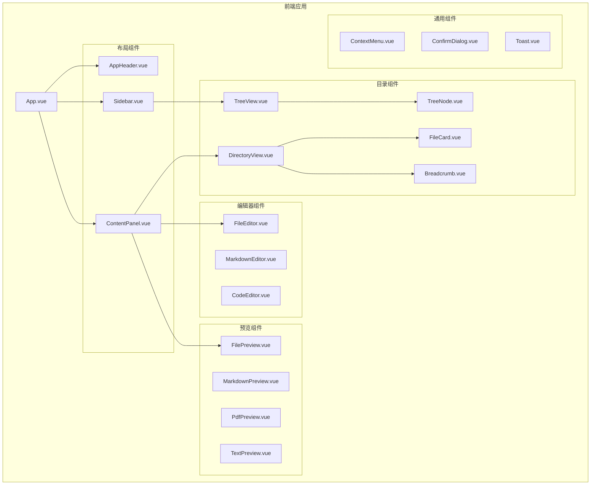

# 设计文档

## 概述

本设计文档描述了文件管理器前端优化的技术实现方案。主要目标是提升UI美观度、增强文件预览和编辑功能、实现目录内容网格展示，并确保响应式布局。

技术栈：
- Vue 3 + TypeScript
- Vite 构建工具
- Monaco Editor（代码编辑器）
- PDF.js（PDF预览）
- marked（Markdown渲染）
- highlight.js（代码高亮）

## 架构



## 组件和接口

### 1. AppHeader 组件

头部组件，展示应用标题和全局操作。

```typescript
interface AppHeaderProps {
  title: string
  onMenuToggle?: () => void
  isSidebarCollapsed?: boolean
}
```

### 2. DirectoryView 组件

目录内容网格视图组件，展示目录下的文件和子目录。

```typescript
interface DirectoryViewProps {
  path: string
  files: FileNode[]
  viewMode: 'grid' | 'list'
}

interface DirectoryViewEmits {
  (e: 'select', node: FileNode): void
  (e: 'navigate', path: string): void
  (e: 'contextmenu', event: MouseEvent, node: FileNode): void
}
```

### 3. FileCard 组件

文件卡片组件，用于网格视图中展示单个文件或目录。

```typescript
interface FileCardProps {
  node: FileNode
  selected: boolean
}

interface FileCardEmits {
  (e: 'click', node: FileNode): void
  (e: 'dblclick', node: FileNode): void
  (e: 'contextmenu', event: MouseEvent, node: FileNode): void
}
```

### 4. Breadcrumb 组件

面包屑导航组件。

```typescript
interface BreadcrumbProps {
  path: string
}

interface BreadcrumbEmits {
  (e: 'navigate', path: string): void
}
```

### 5. MarkdownEditor 组件

增强的Markdown编辑器，支持分屏预览。

```typescript
interface MarkdownEditorProps {
  content: string
  path: string
}

interface MarkdownEditorEmits {
  (e: 'update:content', content: string): void
  (e: 'save'): void
  (e: 'change', hasChanges: boolean): void
}

interface ToolbarAction {
  icon: string
  title: string
  action: string
  shortcut?: string
}
```

### 6. CodeEditor 组件

基于Monaco Editor的代码编辑器。

```typescript
interface CodeEditorProps {
  content: string
  language: string
  path: string
  readOnly?: boolean
}

interface CodeEditorEmits {
  (e: 'update:content', content: string): void
  (e: 'save'): void
  (e: 'change', hasChanges: boolean): void
}
```

### 7. PdfPreview 组件

PDF预览组件，基于PDF.js。

```typescript
interface PdfPreviewProps {
  path: string
}

interface PdfState {
  currentPage: number
  totalPages: number
  scale: number
  loading: boolean
}
```

### 8. ContextMenu 组件

右键上下文菜单组件。

```typescript
interface MenuItem {
  id: string
  label: string
  icon?: string
  disabled?: boolean
  divider?: boolean
}

interface ContextMenuProps {
  items: MenuItem[]
  x: number
  y: number
  visible: boolean
}

interface ContextMenuEmits {
  (e: 'select', id: string): void
  (e: 'close'): void
}
```

## 数据模型

### FileNode（扩展）

```typescript
interface FileNode {
  name: string
  path: string
  type: 'file' | 'directory'
  extension?: string
  size?: number
  children?: FileNode[]
  lastModified?: string
  // 新增字段
  icon?: string
  thumbnail?: string
}
```

### ViewState

```typescript
interface ViewState {
  currentPath: string
  selectedNode: FileNode | null
  viewMode: 'tree' | 'directory' | 'preview' | 'edit'
  sidebarCollapsed: boolean
  directoryViewMode: 'grid' | 'list'
}
```

### EditorState

```typescript
interface EditorState {
  content: string
  originalContent: string
  hasChanges: boolean
  saving: boolean
  language: string
}
```


## 正确性属性

*属性是一种应该在系统所有有效执行中保持为真的特征或行为——本质上是关于系统应该做什么的形式化陈述。属性作为人类可读规格和机器可验证正确性保证之间的桥梁。*

### 属性1: 目录导航一致性

*对于任意*目录路径，当用户点击该目录时，内容面板应显示该目录下的所有直接子项（文件和子目录），且子项数量应与实际目录内容一致。

**验证: 需求 2.1, 2.4**

### 属性2: 目录视图信息完整性

*对于任意*文件节点列表，当渲染为目录视图时，每个文件卡片应包含文件名、图标，且面包屑导航应正确解析当前路径的所有层级。

**验证: 需求 2.2, 2.5**

### 属性3: 文件点击行为一致性

*对于任意*文件类型，当用户在目录视图中点击该文件时，应根据文件类型触发相应的预览或编辑模式。

**验证: 需求 2.3**

### 属性4: Markdown渲染正确性

*对于任意*有效的Markdown文本，当输入到编辑器时，预览面板应渲染出包含相应HTML结构的内容，且代码块应包含语法高亮标记。

**验证: 需求 3.2, 3.3**

### 属性5: 代码编辑器语言检测

*对于任意*支持的文件扩展名，代码编辑器应正确识别并应用相应的语言模式进行语法高亮。

**验证: 需求 4.1**

### 属性6: 上下文菜单触发一致性

*对于任意*文件或目录节点，当用户右键点击时，应显示包含适当操作选项的上下文菜单。

**验证: 需求 6.1**

### 属性7: 响应式布局断点

*对于任意*视口宽度，当宽度小于768像素时侧边栏应处于折叠状态，当宽度大于等于768像素时侧边栏应处于展开状态。

**验证: 需求 7.1**

### 属性8: 触摸目标尺寸

*对于任意*可交互元素，其点击区域的宽度和高度应不小于44像素。

**验证: 需求 7.4**

## 错误处理

### 文件加载错误

```typescript
interface FileLoadError {
  type: 'network' | 'permission' | 'not_found' | 'unknown'
  message: string
  path: string
}

// 错误处理策略
function handleFileError(error: FileLoadError): void {
  switch (error.type) {
    case 'network':
      showToast('网络连接失败，请检查网络', 'error')
      break
    case 'permission':
      showToast('没有权限访问此文件', 'error')
      break
    case 'not_found':
      showToast('文件不存在', 'error')
      refreshTree()
      break
    default:
      showToast('加载失败: ' + error.message, 'error')
  }
}
```

### 保存错误

```typescript
interface SaveError {
  type: 'conflict' | 'permission' | 'disk_full' | 'unknown'
  message: string
}

// 保存失败时保留编辑内容，提示用户重试
function handleSaveError(error: SaveError): void {
  showToast('保存失败: ' + error.message, 'error')
  // 不清除编辑内容，允许用户重试
}
```

### PDF加载错误

```typescript
// PDF加载失败时显示友好提示
function handlePdfError(error: Error): void {
  showPdfError('PDF加载失败，请确保文件格式正确')
}
```

## 测试策略

### 单元测试

使用Vitest进行单元测试：

1. **工具函数测试**
   - 文件图标映射函数
   - 文件排序函数
   - 路径解析函数
   - 文件类型判断函数

2. **组件测试**
   - Breadcrumb路径解析
   - FileCard渲染
   - ContextMenu显示/隐藏

### 属性测试

使用fast-check进行属性测试，每个属性测试运行至少100次迭代：

1. **目录导航属性测试**
   - 生成随机目录结构
   - 验证点击目录后内容面板显示正确

2. **Markdown渲染属性测试**
   - 生成随机Markdown文本
   - 验证渲染结果包含预期的HTML结构

3. **语言检测属性测试**
   - 生成随机文件扩展名
   - 验证语言模式映射正确

4. **响应式布局属性测试**
   - 生成随机视口宽度
   - 验证侧边栏状态符合断点规则

### 测试标注格式

每个属性测试必须使用以下格式标注：

```typescript
/**
 * **Feature: frontend-enhancement, Property 1: 目录导航一致性**
 * **Validates: Requirements 2.1, 2.4**
 */
```

## 样式设计

### 配色方案

```css
:root {
  /* 主色调 */
  --primary-color: #4f46e5;
  --primary-hover: #4338ca;
  --primary-light: #eef2ff;
  
  /* 背景色 */
  --bg-primary: #ffffff;
  --bg-secondary: #f8fafc;
  --bg-tertiary: #f1f5f9;
  
  /* 文字色 */
  --text-primary: #1e293b;
  --text-secondary: #64748b;
  --text-muted: #94a3b8;
  
  /* 边框色 */
  --border-color: #e2e8f0;
  --border-hover: #cbd5e1;
  
  /* 状态色 */
  --success-color: #10b981;
  --warning-color: #f59e0b;
  --error-color: #ef4444;
  
  /* 阴影 */
  --shadow-sm: 0 1px 2px rgba(0, 0, 0, 0.05);
  --shadow-md: 0 4px 6px -1px rgba(0, 0, 0, 0.1);
  --shadow-lg: 0 10px 15px -3px rgba(0, 0, 0, 0.1);
}
```

### 间距系统

```css
:root {
  --spacing-xs: 4px;
  --spacing-sm: 8px;
  --spacing-md: 16px;
  --spacing-lg: 24px;
  --spacing-xl: 32px;
}
```

### 圆角系统

```css
:root {
  --radius-sm: 4px;
  --radius-md: 8px;
  --radius-lg: 12px;
  --radius-xl: 16px;
}
```
